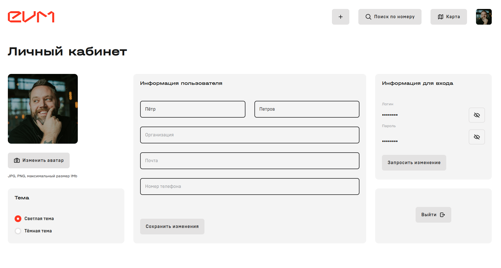

# Client Project "Battery"

## Description
This project demonstrates login functionality with different roles (administrator and client).

## Requirements
- Python 3.x

## Installation
1. Clone the repository:
    ```sh
    git clone https://github.com/soulless-ai/battery.git
    ```
2. Navigate to the project directory:
    ```sh
    cd battery
    ```

## Server Launch
To start the client side, use the command:
```sh
python3 -m http.server 8000
```
## Application Access
### Administrator Login
#### Username: ```example```
#### Password: ```password```
### Client Login
#### Username: ```example3```
#### Password: ```password```

# Home Page


# Login Page


# Administrator Dashboard


# Client Dashboard


